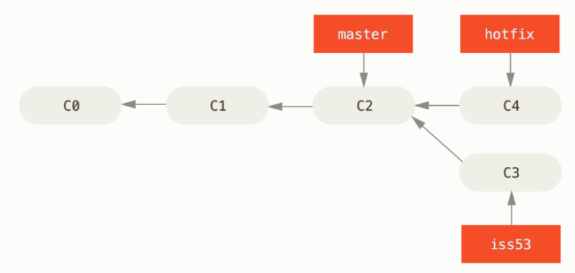
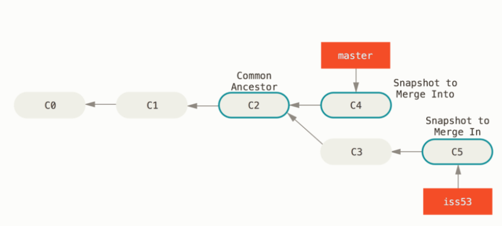

# Version Control
- Version control systems allow for changes in a set of files (i.e. a project) to be recorded
    - Keeping a history of files in track can be useful, especially if it is necessary to revert back to a previous state or pinpoint where exactly a bug was introduced
- One type of version control is **centralized version control**, in which a single server contains a database of a project's different versions, which clients can then request 
    - This allows for consistency among all clients who are contributing to the same project, but is incredibly vulnerable, especially if the server were to fail or have its data corrupted
- Git is a **distributed version control** system, meaning that the full project repository, including its history, is mirrored in each client's device 
# Git 
- Git tracks changes over time based on *snapshots* of the file system at different points of development
    - When a change to a file is committed, a new snapshot of the file with its changed state is stored by Git
        - If there is no change to another file during a given snapshot, then a link to its previous snapshot is used (as to prevent unnecessary disk usage)
    - 
- Git can be used completely locally - there is no need to communicate with external servers when saving changes or viewing a project's history (unless you wish to view changes from a remote repository)
- Git ensures that data is not corrupted by checksumming every commit via a SHA-1 hash. Each commit is represented by the hash used to checksum it.
# Git Basics
- A Git repository can be created from a local directory or by cloning an already existing repository
    - `git init` turns the existing directory into a Git repository, evident by a `.git` directory being created in the existing directory
    - `git clone <url> [NAME]` clones the repository located at url and names it NAME if provided, otherwise it will name it the default name from the url
- In a Git repository, files that Git knows about are *tracked* and all other files are *untracked*. Once a file is tracked, it is considered *unmodified* if no changes have been made to it, *modified* if changes have been made to it, and *staged* if such changes are ready to be committed into a new snapshot
    - The staging area, or index, stores information about what changes will go into the next commit - what goes into the staging area can be selectively chosen, so not all changes have to be committed at once
        - A file is kept in the staging area in the exact state that it was when it was added; if a file is staged and then changed afterwards, then that change will not show up in the staging area unless the file is added to the staging area again
    - When staged files are committed, they return to the unmodified status
    - `git status` displays the status of the files in the current repository - such as whether they are modified or staged
        - `-s` flag displays a more compact status message, with shorthand symbols to represent a file status in the staging area and status in the working directory
    - 
- `git add FILE...[FILE2]` will:
    - Track FILE if it was previously untracked
    - Add FILE to the staging area if it is already tracked and was modified
- `git commit` will add the files to the staging area in the latest snapshot, with a commit message inserted via the text editor specified under the Git configuration settings
    - `-m MESSAGE` flag allows for the commit message to be specified in the command instead of via a text editor
    - `-a` flag allows for every file being tracked to be automatically staged before the commit (so there is no need to do `git add`)
- `git rm FILE` untracks FILE and removes it from the current working directory
    - `-f` forces the removal of FILE if it had already been added to the staging area 
    - `--cached` untracks FILE but does not remove it from the current working directory
- `git mv FROM TO` renames or moves file FROM to TO 
    - Using `mv` may fail as Git does not necessarily track file movement or renaming
- A `.gitignore` file contains a list of filenames or patterns for filenames that Git should not automatically add or track
# Viewing History
- `git diff` will:
    - If no arguments are added, show the differences between the working directory and the staging area 
    - If `--staged` is added, show the differences between the staging area and the last commit
    - If `HEAD` is the argument, show the differences between the latest commit and the current working files
    - If `VERSION1..VERSION2` is the argument, show the differences between the commit represented by VERSION1 and the commit represented by VERSION2 (VERSION1 and VERSION2 can be the commit hashes or tags)
- `git log` will: 
    - If no arguments are added, display the history of the current repository, listing each **commit**, its **author**, its **author date**, and its **commit message**
    - If `A..B` are the arguments, display the history from, but not including, version A up to and including version B, where A and B can be the commit hashes or tags representing commits
        - `HEAD` is an identifier for the latest version
        - `A^` is an identifier for the version before A
    - If `-p` is added, display the difference (patch) introduced in each commit
    - If `-[NUM]` is added, limit the log entries displayed to NUM entries
    - If `--stat` is added, display abbreviated stats for each commit
    - If `--graph` is added, display an ASCII graph representing the branching and merging history
    - If `-S STRING` is added, display only commits that remove or add code matching STRING
    - If `--grep STRING` is added, display only commits that remove or add code matching the pattern in STRING
    - If `--pretty` is added, display the output in the specified format
        - `--pretty=oneline` prints each commit on a single line
        - `--pretty=short`, `--pretty=full`, `--pretty=fuller` prints varying amounts of information
        - `--pretty=format:"FORMAT STRING"` prints according to a specified format string
            - `%H` is commit hash
            - `%h` is abbreviated commit hash
            - `%T` is tree hash
            - `%t` is abbreviated tree hash
            - `%P` is parent hash(es)
            - `%p` is abbreviated parent hash(es)
            - `%an` is author name
            - `%ae` is author email
            - `%ad` is author date
            - `%ar` is author date, relative
            - `%cn` is committer name
            - `%ce` is committer email
            - `%cd` is committer date
            - `%cr` is committer date, relative
            - `%s` is subject    
# Undoing Changes
- `git commit --amend` takes the staging area and uses it for a commit that replaces the most recent commit
    - Internally, this branches off of the old commit and "abandons" the branch containing the broken commit
    - Using the amend option should be avoided within remote repositories, though it is completely safe in a local repository
- `git reset HEAD FILE` removes FILE from the staging area
    - This can alternatively be done with `git restore --staged FILE`
- `git checkout -- FILE` discards the current changes of a modified file and returns it to as it was in the previous commit
    - This can alternatively be done with `git restore FILE`
# Remotes
- A remote repository is a repository that is hosted nonlocally (typically on the Internet)
    - In a collaborative environment involving remote repositories, it is important to ensure that the local version of the repository is kept up to date with the remote version
- `git remote` lists the remotes of a repository, with the default being `origin`
    - If a repository were created using `git init`, then this command should output nothing
    - `-v` flag outputs the URL of each remote
- `git remote show <remote>` provides more information about a remote, such as the remote's own branches and how local branches are configured to pull or push with the remote
- `git remote add <shortname> <url>` adds a clone of name shortname from url
- `git remote rm REMOTE` removes remote REMOTE and all remote-tracking branches and configurations associated with it
- `git remote rename OLD NEW` renames a remote from OLD to NEW
- `git fetch <remote>` fetches up-to-date data from the remote but does not actually merge this data with the local repository
    - By default, this will fetch from `origin` is no explicit remote is specified
- `git pull <remote>` will fetch and merge the remote branch into the current branch
- `git push <remote> <branch>` pushes changes from the specified branch upstream to the remote
    - i.e. `git push origin master` pushes the master/main branch to the origin remote
    - You can only push if the local branch is up to date with the remote (so pull first)
# Tags
- Tags can be used as an alternate way to refer to a commit (instead of by its hash) - typically for version releases of a project
- Unlike branches, tags are not meant to "move" - that is, they are meant to always refer to the same version of a project
- Tags are either lightweight or annotated
    - Lightweight tags are just pointers to specific commits 
    - Annotated tags are treated as full objects by Git - they are checksummed, contain the tagger's name and email, have a tagging message, etc.
- A signed tag is used to "endorse" that a version is valid
    - `git tag -s TAGNAME -m "MESSAGE"`
        - `-s` signs the tag with GPG (GNU Privacy Guard)
    - `git tag -v TAGNAME` is used to verify the tag (usually by another individual)
- `git tag` lists the existing tags for a repository
    - `git tag -l PATTERN` searches for all tags matching that specific pattern
- `git tag -a NAME -m MESSAGE` creates an annotated tag with name NAME and message MESSAGE
- `git tag NAME` creates a lightweight tag with NAME
- Commits can be tagged after they occur by specifying the commit hash in the `git tag` command
- `git show TAGNAME` shows information related to a tag - such as the commit associated with that tag and, if the tag is annotated, the tag hash and information
- `git push <remote> TAGNAME` pushes all information regarding tags to remote - tags are not pushed by default
- `git tag -d TAGNAME` removes tag TAGNAME
    - `git push <remote> --delete <tagname>` deletes a remote tag
- `git checkout TAGNAME` checks out to the version of the repository represented by TAGNAME
    - This puts the repository in **detached HEAD state**, where changes are not recorded unless a branch is created from the commit

# Branching
- Branching in Git involves diverging from a main line of development - which may useful when trying to experiment with new features or fix a bug without disturbing progress on a branch that others may potentially be working on 
- When a commit is made, Git creates a **working tree**, containing a list of pointers to files (known as **blobs**). A commit object is made, containing a pointer to this tree, as well as other important metainformation, such as *pointers to the commit or commits that came before it*
    - 
    - 
- A branch can be viewed as simply a **pointer** to any commit that is automatically moved forward per each subsequent commit 
    - The default branch in a project is master (or main)
- `git branch` 
    - `NAME [ID]` creates a new branch pointer named NAME
        - The branch pointer will point to the commit ID if specified or `HEAD` if no argument is otherwise provided
        - `HEAD` refers to the current branch
    - `-d NAME` deletes the branch NAME 
    - `-D name` forces the deletion of branch NAME (usually for branches that have not been merged)
    - `--move OLDNAME NEWNAME` renames the branch
        - `git push --set-upstream origin NEWNAME` pushes a branch with NEWNAME to the remote
        - `git push origin --delete NAME` deletes the branch with NAME on the remote 
    - `git branch` alone will list all branches, with a `*` denoting the current branch
        - `-v` will list the latest commit on each branch
        - `--merged` will list all branches that have merged to the current branch
        - `--no-merged` will list all branches that have not been merged to the current branch
    - 
- `git checkout BRANCH` switches the `HEAD` pointer to point to BRANCH
    - `-b NAME` creates a new branch with NAME and then switches to it
    - Git does not allow switching branches if there are uncommitted changes that conflict with the branch being switched to 
        - You can either commit your changes or stash them
- A project *diverges* when work is done and committed on separate branches     
    - 

# Merging
- `git merge BRANCH` merges the current branch with BRANCH
    - i.e.
        -     git checkout master
              git merge hotfix
- When merging divergent branches, there are simple cases where Git is able to perform the merging without any conflicts
    - A fast-forward merge involves resolving a linear set of changes by simply moving a branch pointer forward
        - 
        - 
    - A three-way merge involves resolving a divergent set of changes by using a common ancestor of the two branches being merged, applying the changes made from each branch relative to the ancestor (if there are no conflicts), and then creating a new snapshot with such changes applied
        - 
        - 
- Merge conflicts occur when trying to reconcile branches that make changes to the same part of a file in different ways 
    - When merge conflicts occur, Git does not automatically try to resolve them but rather leave it up to the user to manually make the resolutions
    - `git status` can be used to show files with unmerged paths, which will contain conflict-resolution markers within them:
        -     <<<<< HEAD:index.html
              CHANGES
              ======
              DIFFERENT CHANGES
              >>>>> iss53: index.html
    - After a conflict is manually resolved, `git commit` can be used to finalize the merge
# Remote Branches
- Remote-tracking branches are references representing the state of a branch on the upstream remote
    - Remote-tracking branches take the form of `<remote>/<branch>`
        - i.e. `origin/master` refers to the master branch of the origin remote (the default remote created when cloning)
    - These remote-tracking branches cannot be moved locally - rather, they act as an indicator of where exactly the remote is
        - 
- `git push REMOTE BRANCH` will create a new branch on REMOTE based on local BRANCH
- Fetching a remote-tracking branch does not allow for it to be altered - you can either merge it into your current branch (`git merge <remote>/<branch>`) or create a new, local branch based on the remote using `git checkout -b LOCALNAME <remote>/<remote branch name>`
    - Checking out a local branch from the remote-tracking branch creates a *tracking branch*, which are local branches that have a direct relationship with the remote branch
        - Git will know to use that remote branch when `git pull` is used
- `git branch -u <remote>/<branch>` sets an already existing local branch to track a specified remote branch
- `git branch -vv` lists all local branches and information about what each branch is tracking (and if they are ahead or behind the remote)
# Rebasing
- Rebasing is an alternative to merging. Instead of reconciling two divergent branches, rebasing involves applying all the changes committed on one branch and applying them to the other
    - Rebasing allows for the same end result as a merge, but displays the changes linearly in the `git log` history as opposed to the nonlinear changes from a merge
- `git rebase BRANCH` applies the changes of the current branch onto BRANCH
    - i.e. Rebasing the changes of experiment onto master
        -     git checkout experiment
              git rebase master
        - 
        - 
            - `git merge experiment` can then be used to fast-foward master to experiment
- Rebasing should be avoided for branches that others are working on (remotes), as it could confuse other developers - it is best to rebase with completely local changes and then merge those changes to a remote if necessary

# Git Tools
## Revision Selection
- A specific commit can be referred to either by its full hash or a partial version of a hash (that is not ambiguous)
- If a specific commit is a tip of a branch, then that commit can also be referred to by the branch name
- The `^` symbol refers to the ancestor of a commit - if there are multiple parents, you can include a number afterwards to specific which parent
    - i.e. `d921970^2` refers to the second parent of the commit represented by that hash (perhaps in the context where the commit is a merge commit)
- The `~` symbol also refers to the parent of a commit, but it always refers to the first parent. Including a number afterwards refers to the nth grandparent
    - i.e. `HEAD~3` refers to the first parent of the first parent of the first parent of HEAD
- `A..B` specifies a commit range that is reachable from B but not reachable from A
    - In the context of a linear development, this will refer to all commits in the range (A, B] (note that A is not included)
    - `git diff A..B` will not actually compute the difference of the commit range but just the difference of A and B
- `A...B` specifies commits that are reachable by either A or B but not both
    - `git diff A...B` will compare the common ancestor of A and B and B
- Including a `^` *before* a commit identifier can be used to specify all commits that are not that identifier
    - i.e. `git log refA refB ^refC` specifies all commits that are reachable by refA and refB but not by refC
## Interactive Staging
- `git add -i` opens an interactive staging shell, which allows for files to be selectively staged
    - Specific parts of a file can be staged by using the `p` option (patch)
## Stashing and Cleaning
- Stashing takes the state of the working directory (all files that are tracked and modified) and saves it on a stack of unfinished changes that can be reapplied later
    - This is useful for needing to switch branches without wanting to commit changes on the current branch
- `git stash` pushes a new stash onto the stack
    - `--keep-index` flag includes the staged content in the stash but also keeps it in the index
    - `--include-untracked` includes untracked files in the stash (but not .gitignored files)
    - `--patch` will interactively prompt which changes to stash
- `git stash list` lists all stashes on the stack
- `git stash apply` applies the latest stash
    - `git stash apply stash@{n}` applies the nth latest stash
- `git stash drop` removes a stash
- `git stash pop` applies the latest stash and then drop it from the stakc
- `git stash branch BRANCHNAME` creates a new branch with the stash commit and stash applied 
- `git clean` will remove untracked files that are not ignored 
## Searching
- `git grep [SOURCE] PATTERN` searches through the working directory (default), index, or any working tree for a regular expression PATTERN
    - `-E` for extended regular expressions
    - `-n` flag prints out line numbers where Git has found matches
    - `-c` outputs only the number of matches for each file
    - `-p` outputs the context around the found pattern (i.e. function enclosing)
- `git log -S PATTERN` shows commits that changed the number of occurences of PATTERN
- `git log -L PATTERN` shows the history of a function or line of code
    - i.e. `git log -L :git_deflate_bound:zlib.c` finds the changes made to the git_deflate_bound function in the zlib.c file
## Rebasing
- The interactive rebase tool can be used to rebase a series of commits
- `git rebase -i [COMMIT]` allows for the interactive rebasing of all commits from COMMIT to HEAD (i.e. `git rebase -i HEAD~3` rebases from HEAD~3..HEAD)
    - `edit` allows for a prior commit to be edited by rewinding to that commit (which can then be amended)
    - `squash` allows for multiple commits to be combined into one
    - `drop` deletes a commit
- `git rebase --abort` stops the rebase and returns to the original state
## Debugging
- `git blame FILE` lists the commits (and authors) that made changes to FILE
    - `git blame -L L1,L2 FILE` restricts the output to commits that has made changes to lines L1-L2 of FILE
- `git bisect` performs a binary search through the commit history to identify the commit that created the issue
    - `git bisect start` starts the bisect, which will then present different versions of the repository for the user to observe
    - `git bisect bad` indicates that the current commit is bugged
    - `git bisect good [COMMIT]` indicates that the current commit (or COMMIT) is not bugged
    - `git bisect reset` resets HEAD to where it was at the beginning of the bisection
    - `git bisect run SCRIPT` will automate the bisection process if SCRIPT exits with 0 if the testing succeeded and nonzero if the testing failed
## Reflog
- `git reflog` inspects the ref log, which is a listing of changes made 
    - The ref log is local, it is not pushed upstream
## Git Object Naming
- **pathspec** - working file names
- **commit** - commit hash, tag, branch name
- If there is ambiguity in a Git command, `--` can be used to separate commit names and filenames
    - i.e. `git diff main -- foo.c` compares differences between foo.c in main and foo.c in the working directory